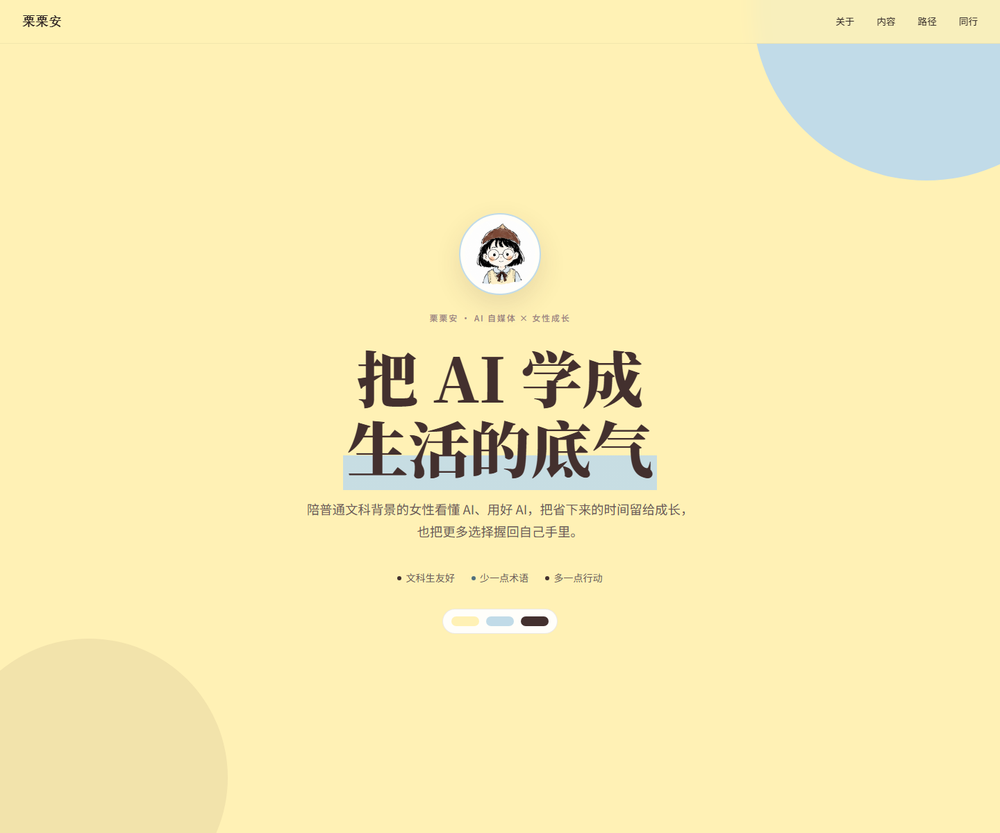

# 栗栗安 Personal Design Skill

一套给 AI 看的栗栗安个人品牌设计系统，服务于 AI 自媒体与女性成长内容。

**栗栗安** · 温暖 × 知性 × 高级 · 帮助普通文科背景女性用 AI 提效并实现自我成长

> 本版本基于 [ESTHER不二的 esther-design-system](https://github.com/esthersjw/esther-design-system) 修改，遵循 CC BY-NC-SA 4.0。



## 上游授权与身份说明

以下身份说明来自原作者，个性化使用时仍需遵守：

> **开源的是方法论，不是我的身份。**
>
> 本仓库开源的是我整理出的设计方法论、设计规范、工作流程、布局模式、组件模式和相关模板。你可以基于 CC BY-NC-SA 4.0 学习、修改和分享这些内容，但这不代表你获得了使用 **ESTHER不二 / Esther / 不二 / esthersjw** 的姓名、头像、IP形象、Logo、品牌标识、个人账号标识或本人形象进行创作、运营、发布、商业合作或对外背书的许可。
>
> 使用这套系统时，请替换为你自己的姓名、头像、IP和品牌信息。任何使用本仓库内容制作的账号、作品、产品、课程、Agent 或服务，都不得让人误以为由我制作、授权、合作或背书。协议要求的署名仅表示内容来源，不等于身份授权。

把审美写成操作手册，AI 每次帮你做页面时必须翻这本手册，不能自由发挥。**限制 AI 的自由度 = 保证输出质量。**

> ✅ 栗栗安的品牌色、气质、内容方向、目标受众和正式头像已经写入并同步到全部模板。

---

## Demo

🔗 [打开完整视觉验收台](visual-overview.html)

### 栗栗安品牌示例

- [个人品牌示例页](demo-lilian-brand.html)
- [首屏预览图](assets/lilian-brand-preview.png)

以下场景演示已同步栗栗安品牌配色、正式头像与个人署名：

### 📖 教程型 - Design Skill 拆解

把审美写成操作手册——从纠正AI到做出自己的Design Skill的完整过程。

🔗 [查看栗栗安版本](demo-readme-tutorial.html)

---

### 🎪 活动页 / Landing

视觉冲击、深浅面板交替、强节奏感的活动邀请页。

🔗 [查看栗栗安版本](demo-landing.html)

---

### 📱 App 型 / 功能型

功能优先、交互感、信息密度高的应用型页面。

🔗 [查看栗栗安版本](demo-app.html)

---

### 📕 小红书图文卡片

3:4 比例、字大、手机可读、一键导出 PNG 的图文卡片。

🔗 [查看栗栗安版本](demo-cards.html)

---

### 📱 公众号排版

杂志编号风：全内联样式 + section 标签，复制粘贴进微信公众号编辑器即可。

🔗 [查看栗栗安版本](assets/demo-wechat.html)

---

### 📜 布局 Playground

16种经过验证的布局模式一览。

🔗 [查看栗栗安版本](demo-layouts.html)

---

### 🧩 组件库全览

51个经过验证的可复用组件。

🔗 [查看栗栗安版本](components-preview.html)

---

## 核心逻辑

```
SKILL.md(流程 - AI 按什么步骤干活)
    ↓
brand-dna.md + references/*(规范 - 能用什么不能用什么)
    ↓
assets/template-*.html(起点 - 从模板改,不从零写)
```

- AI 不能随便发明布局 → 只能从 16 种里选
- AI 不能随便用颜色 → 只能用你定义的品牌色 + 扩展规则
- AI 不能随便写样式 → 必须从组件库里选
- AI 做完要自检 → 对照 checklist 逐条过，P0 不过就打回

---

## 文件结构

```
esther-design-system/
├── SKILL.md                    ← 7步工作流(大脑)
├── brand-dna.md                ← 品牌基因:颜色/字体/气质/禁忌(需配置)
├── assets/                     ← 模板骨架(起点)
│   ├── template-tutorial.html      教程页模板
│   ├── template-landing.html       活动页模板
│   ├── template-app.html           App型模板
│   ├── template-cards.html         小红书卡片模板
│   ├── html2canvas.min.js          卡片导出依赖
│   ├── avatar-placeholder.svg      头像缺失时的品牌占位图
│   └── avatar.png                  栗栗安正式头像
└── references/                 ← 规则和零件(知识库)
    ├── layouts.md                  16种布局模式(附完整代码)
    ├── components.md               组件库(51组件,完整HTML+CSS)
    ├── checklist.md                质量检查清单(P0/P1/P2)
    ├── scene-tutorial.md           教程场景规范
    ├── scene-landing.md            活动页场景规范
    ├── scene-app.md                App型场景规范
    ├── scene-cards.md              小红书卡片场景规范
    └── scene-wechat.md             公众号排版场景规范
```

---

## 7 步工作流

AI 每次做设计必须按这个顺序走：

| # | 做什么 | 为什么 |
|---|--------|--------|
| 1 | 问 5 个问题(类型/受众/几屏/素材/约束)。类型含：教程/活动页/App/卡片/**公众号** | 不自作主张 |
| 2 | 读 brand-dna + 对应场景文件 | 先学规矩再动手 |
| 3 | 从 assets/ 复制对应模板 | 从半成品开始，不从零写 |
| 4 | 从 layouts.md 选 3-5 种布局 | 每个 section 不能一样 |
| 5 | 从 components.md 选组件 | 禁止用 HTML 默认样式 |
| 6 | 对照 checklist 自检 | P0 不过就打回 |
| 7 | 交付 HTML 文件 | 浏览器打开就能看 |

---

## 品牌基因速览

### 栗栗安三主色 + 第四辅助色

| 颜色 | 色值 | 比例 |
|------|------|------|
| 酪乳黄 | `#FFF1B5` | 50% |
| 旧勃艮第棕 | `#43302E` | 25% |
| 柔雾蓝 | `#C1DBE8` | 15% |
| 奶油米黄 | `#FFF8DE` | 10% |

长页面必须至少出现一个酪乳黄大板块、一个柔雾蓝内容板块、一个旧勃艮第棕重点板块和一个奶油米黄承托区。第四色正式计入比例，四色约为 50:25:15:10；不再使用其他暖米灰。暖白 `#FFFEFA` 仅用于卡片内部或高密度正文阅读面，单页可见面积不超过 20%，不能成为整页或整段背景。

### 字体

| 用途 | 字体 |
|------|------|
| 中文标题 | 汇文明朝体 / Noto Serif SC |
| 中文正文 | Noto Sans SC |
| 英文装饰 | Fraunces italic |
| 手写/注释 | Caveat |
| 代码/终端 | Fira Code |

### 气质关键词

温暖 · 知性 · 高级 · 柔和但有力量 · **不像 AI** · 一看就是栗栗安

### 禁忌

科技蓝 · 蓝紫渐变 · glassmorphism · neon · 黑客终端感 · bounce 动画 · Inter/Roboto · 所有 section 居中 · HTML 默认样式 · 看起来像 AI 生成的通用模板

---

## 质量检查

**P0(必须全过)**

品牌四色比例 50:25:15:10 · 无禁忌元素 · 无 HTML 默认样式 · 暖底背景 · 衬线+无衬线混搭 · 响应式 · 每 section 布局不同 · clamp() fluid sizing · 截图发社交媒体不会被说"又是 AI 做的"

**P1(应过)**

至少一个视觉惊喜 section · 字号对比极端 · Scroll Reveal 动效 · 大装饰数字/英文

**P2(加分)**

图片溢出容器 · 深色面板打破节奏 · 装饰元素克制 · prefers-reduced-motion

---

## 怎么用

1. Fork 或克隆本仓库
2. 栗栗安头像已放入 `assets/avatar.png`，更换时保持文件名不变
3. 直接使用已完成配色同步的 `assets/template-*.html`
4. 如未来更换配色，先改 `brand-dna.md`，再同步模板变量；公众号模板为内联样式，需要单独搜索替换
5. 把仓库链接发给你的 AI Agent，跟它说：

> 帮我读这个设计系统，以后做页面按这个规范来。

核心不是这些文件本身，是**你的审美判断力**。文件只是把你的判断写成了 AI 能执行的规则。

---

## Credits

- 方法论灵感来源于 [归藏](https://github.com/guizang) 的 PPT Skill——“限制AI的自由度 = 保证输出质量”这个核心思路参考了他的设计
- Built with [Cola](https://colaos.ai) — the first OS with a soul

---

## License

[](https://creativecommons.org/licenses/by-nc-sa/4.0/)

本仓库中的方法论、设计规范、工作流程、布局模式、组件模式、模板和文档，采用 [CC BY-NC-SA 4.0](https://creativecommons.org/licenses/by-nc-sa/4.0/) 协议。

- ✅ 可以学习、使用、修改和分享本仓库中的方法论与设计内容
- ✅ 必须注明来源：ESTHER不二 / [esther-design-system](https://github.com/esthersjw/esther-design-system)
- ❌ 禁止将本仓库内容用于商业用途
- 🔄 修改后必须以相同协议分享
- ❌ 署名不等于姓名、头像、IP、Logo、品牌标识或本人形象的使用授权
- ❌ 不得使用我的名字、头像、IP或其他身份标识创建看起来由我运营、授权、合作或背书的账号、作品、产品、课程、Agent或服务

### Name, Image and IP Notice

**ESTHER不二、Esther、不二、esthersjw** 及与我相关的姓名、头像、IP形象、Logo、品牌标识、个人账号标识和本人形象，不属于本仓库 CC BY-NC-SA 4.0 的授权范围。

你可以在协议要求的范围内进行事实性来源署名，但不得把这些名称或视觉资产用作自己的账号名、用户名、头像、品牌名、角色名、产品名或对外宣传素材，也不得暗示与我存在官方关系。
